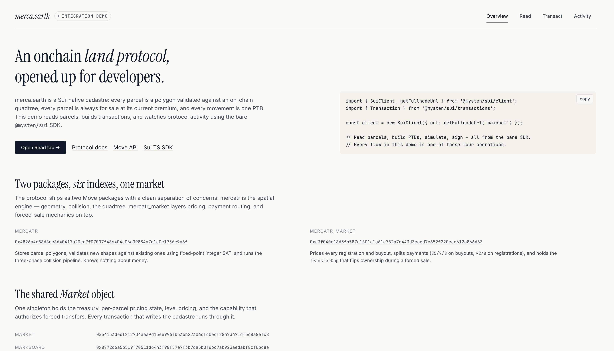

# merca.earth · integration demo

A small TypeScript reference for building on top of [merca.earth](https://merca.earth) — an
onchain land protocol on Sui. Read parcels, build transactions, and watch protocol
activity from a clean SDK.

The demo ships as **a Vite web app + runnable Node scripts** in one repo. Both share the
same `src/merca/` SDK helpers, so anything you see in the browser you can also do from a
terminal.



> Public docs: <https://docs.merca.earth>
> Deployed contracts: <https://docs.merca.earth/reference/deployed-contracts>

---

## Quickstart

```bash
pnpm i
pnpm dev          # Vite at http://localhost:5173
```

Or, from the terminal:

```bash
pnpm read:market         # treasury, paused, parcel counts per level
pnpm read:activity       # last 25 protocol transactions
pnpm read:parcel 0x…     # one parcel: premium, sale count, current buyout price
```

No environment variables are required for read-only flows — `https://fullnode.mainnet.sui.io:443`
is the default. To override (e.g. for an indexer-backed RPC):

```bash
cp .env.example .env
# edit SUI_RPC_URL=…
```

---

## What's inside

```
merca-demo/
├── src/merca/        SDK helpers — used by both web and scripts
│   ├── constants.ts    every package and object ID
│   ├── client.ts       SuiClient factory
│   ├── pricing.ts      pure-TS port of mercatr_market::pricing
│   ├── market.ts       readMarketState / readLevelStats / readParcelMarketState
│   ├── parcels.ts      queryViewport / readParcel / findParcelLevel
│   ├── activity.ts     recentActivity — classified protocol calls
│   ├── tx.ts           PTB builders + dryRun helper
│   ├── format.ts       MIST/SUI, premium ×, area, address shortening
│   └── types.ts        shared types
├── src/web/          React + Vite UI (Overview / Read / Transact / Activity)
├── scripts/          runnable .ts examples
├── tests/            vitest — unit + opt-in integration
└── docs/             ARCHITECTURE.md, INTEGRATION.md
```

---

## Architecture, in one screen

merca.earth ships as **two Move packages** with a clean separation of concerns:

**`mercatr`** — spatial engine: geometry, collision, the quadtree.
[`0x4826a4d88d8ec8d40417a20ec7f07007f486404e06a09834a7e1e0c1756e9a6f`](https://suiscan.xyz/mainnet/object/0x4826a4d88d8ec8d40417a20ec7f07007f486404e06a09834a7e1e0c1756e9a6f)

**`mercatr_market`** — pricing, payment routing, forced-sale market.
[`0xd3f040e18d5fb587c1801c1a61c782a7e443d3cacd7c652f220cec612a866d63`](https://suiscan.xyz/mainnet/object/0xd3f040e18d5fb587c1801c1a61c782a7e443d3cacd7c652f220cec612a866d63)

**Shared `Market` object** — treasury, levels, capabilities, pause switch.
[`0x54133dedf212704aaa9d13ee996fb33bb22306cfd0ecf28473471df5c8a8efc8`](https://suiscan.xyz/mainnet/object/0x54133dedf212704aaa9d13ee996fb33bb22306cfd0ecf28473471df5c8a8efc8)

Plus six shared `Index` objects — one per cadastral level (Block → Continent). Every
registration, buyout, and tax collection reads and writes the Market; every spatial query
touches one of the indexes. The full address list lives in
[`src/merca/constants.ts`](./src/merca/constants.ts).

The demo follows this flow:

```
read protocol  →  quote price  →  build PTB  →  simulate (devInspect)  →  (opt-in) sign
```

Every transaction in the **Transact** tab is dry-run by default. The single live path is
`marks::mark` (any user can mark any parcel for a small fee), available behind an
explicit "sign and execute" disclosure.

For a deeper architecture walkthrough, see [`docs/ARCHITECTURE.md`](./docs/ARCHITECTURE.md).

---

## Reading the protocol

```ts
import { readMarketState, readLevelStats, readParcel, findParcelLevel } from './src/merca';

const market = await readMarketState();
// → { marketId, paused, treasuryMist }

const levels = await readLevelStats();
// → [{ levelKey: 'block', parcelCount, cellSize, maxDepth }, …]

const level = await findParcelLevel(parcelId);
const parcel = await readParcel(parcelId, level!);
// → { polygonId, levelKey, indexId, market: { premiumPpm, saleCount, currentPriceMist } }
```

Under the hood every read is a `devInspectTransactionBlock` call against a public Move
function — `market::is_paused`, `market::treasury_balance`, `index::count`,
`trading::current_price`, etc. No off-chain indexer required.

---

## Building a transaction

The `marks::mark` flow shows the whole loop in one place — build, simulate, optionally sign.

```ts
import { buildMarkTx, dryRun, getClient } from './src/merca';

const tx = buildMarkTx({
  polygonId,
  level: 'block',
  markType: 1,
  amountMist: 1_000_000n, // 0.001 SUI
});

const sim = await dryRun(tx, mySenderAddress);
console.log(sim.status, sim.gasUsedMist, sim.events.length);

if (sim.status === 'success') {
  // Optional: sign and execute. Use a dedicated dev wallet.
  await getClient().signAndExecuteTransaction({ signer: keypair, transaction: tx });
}
```

`buildBumpPriceTx`, `buildDropPriceTx`, and `buildBuyFullTx` follow the same shape — all
three forward leftover payment back into the gas coin, so no recipient address is needed
at build time.

Run from the terminal:

```bash
pnpm tx:build-mark 0x<polygonId>            # builds + dry-runs, prints simulated gas + events
SUI_PRIVATE_KEY=… pnpm tx:sign-mark 0x<id>  # actually signs and submits
```

---

## Activity feed

The Activity tab polls every six seconds. The helper is one call:

```ts
import { recentActivity } from './src/merca';

const items = await recentActivity(undefined, 25);
// → [{ digest, timestampMs, kind: 'mark' | 'buy_full' | …, sender, polygonId, … }]
```

Internally it asks the fullnode for transactions whose first MoveCall lives in
`mercatr_market` and classifies each by `(module, function)`. For event-level feeds
instead, see `client.queryEvents` keyed by `MoveEventModule`.

---

## Tests

```bash
pnpm test                    # unit tests (pricing math, format, PTB shape)
RUN_INTEGRATION=1 pnpm test  # adds live mainnet reads (parcels + activity)
```

Unit tests are pure and offline. Integration tests are gated on `RUN_INTEGRATION=1` so
`pnpm test` in CI never accidentally hammers the public fullnode.

---

## Caveats

- **Mainnet only.** The protocol is deployed there; testnet has no equivalent.
- **Always dry-run buyouts.** `trading::buy_full` is irreversible and reassigns ownership
  in the same PTB that collects payment. The web UI never auto-signs it.
- **Treat private keys like wallets.** The web app's "sign and execute" panel keeps your
  key in localStorage if you opt in. Use a dedicated dev wallet you can rotate.
- **Pricing math is mirrored locally.** `pricing.ts` re-implements `mercatr_market::pricing`
  for client-side quoting. The on-chain `current_price` is the authority — cross-check
  before submitting real money.

---

## Reference

- Protocol: <https://docs.merca.earth/protocol/how-it-works>
- Move API: <https://docs.merca.earth/reference/api>
- Architecture: <https://docs.merca.earth/reference/architecture>
- Deployed contracts: <https://docs.merca.earth/reference/deployed-contracts>
- Yellowpaper: <https://docs.merca.earth/papers/yellowpaper>
- Sui TypeScript SDK: <https://sdk.mystenlabs.com/typescript>

## License

[MIT](./LICENSE).
